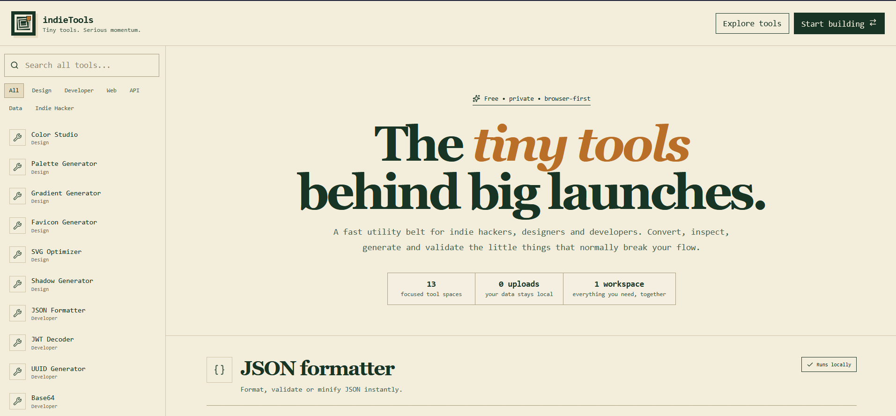

# indieTools

A focused collection of practical browser-based tools for developers, designers and indie hackers.

**Fast utilities. One place. No unnecessary workflow.**

<p align="center">
  
</p>

indieTools brings together the small tools you repeatedly need while building and shipping products: formatting data, generating identifiers, working with colors, converting dates and timezones, inspecting tokens, transforming text and more.

## Tools

### Design

- **Color Studio** — color picker, HEX/RGB/HSL conversion, palette generation, gradients and WCAG contrast checking

### Developer

- **JSON Formatter** — format, validate and minify JSON
- **Base64** — encode and decode Base64
- **URL Encoder** — encode and decode URL components
- **UUID Generator** — generate UUID v4 identifiers
- **Timestamp Converter** — convert Unix timestamps to readable dates
- **Timezone Converter** — convert dates and times between IANA timezones

### Text

- **Slug Generator** — generate clean, SEO-friendly slugs
- **Case Converter** — camelCase, PascalCase, snake_case and kebab-case
- **Text Analyzer** — word count, character count, sentences and estimated reading time
- **Lorem Ipsum** — generate placeholder copy for prototypes and mockups

### Security

- **Password Generator** — generate strong random passwords
- **JWT Decoder** — inspect JWT headers and payloads locally in the browser

## Privacy-first utilities

The utilities are designed to run directly in the browser whenever possible. Sensitive inputs such as JWTs do not need to be sent to a remote service just to inspect or transform them.

## Tech stack

- **Next.js 16**
- **React 19**
- **TypeScript**
- **Lucide React**

The project intentionally stays lightweight and does not require a backend for its core utilities.

## Getting started

Requirements:

- Node.js
- npm

Clone the repository and install dependencies:

```bash
git clone https://github.com/ennouaimi/indie-tools.git
cd indie-tools
npm install
```

Start the development server:

```bash
npm run dev
```

Then open `http://localhost:3000`.

## Production build

```bash
npm run build
npm start
```

## Project structure

```text
indie-tools/
├── pages/
│   ├── _app.tsx
│   ├── index.tsx
│   └── saas-tools.tsx
├── public/
├── styles/
├── package.json
└── tsconfig.json
```

## Philosophy

A lot of development work involves tiny repetitive tasks that are too small to justify installing another application or searching for a different website every time.

indieTools keeps those utilities together behind a consistent interface so you can stay focused on building.

## Contributing

Ideas for useful, focused tools are welcome. A good addition should be quick to understand, useful repeatedly, and preferably work entirely client-side.

---

Built for people who ship.